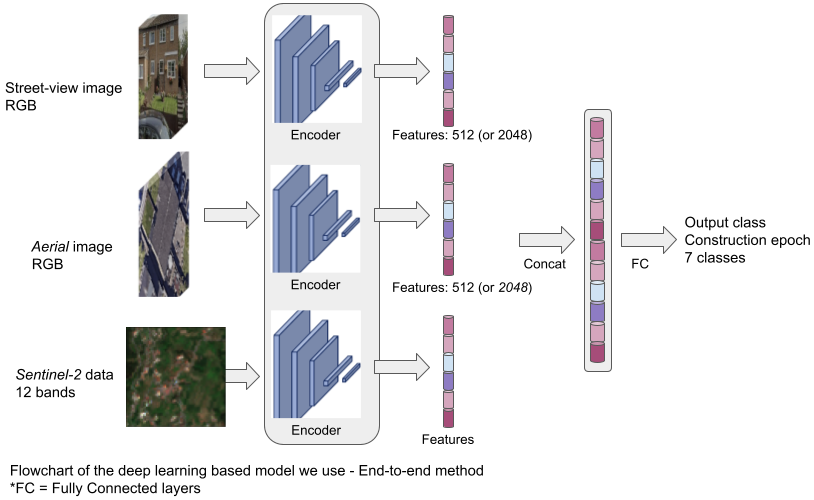

# MapYourCity
Starter notebook for AI4EO #MapYourCity Challenge

 - The main file in this repo is: [MapYourCity-data-exploration.ipynb](MapYourCity-data-exploration.ipynb)

 - An example DataLoader (PyTorch) for the MapYourCity dataset can be found in: [src_model/MapYourCity_ExampleDataLoader.py](src_model/MapYourCity_ExampleDataLoader.py)

 - For the baseline model, the files are: [src_model/MapYourCity_ExampleTrain.py](src_model/MapYourCity_ExampleTrain.py) and [src_model/MapYourCity_ExampleTest.py](src_model/MapYourCity_ExampleTest.py) (and [model_notebook/Challenge_AI4EO_Model_Notebook.ipynb](model_notebook/Challenge_AI4EO_Model_Notebook.ipynb))

## Flowchart diagram for the baseline model

The model performs data fusion of the three different modalities of street-view images, aerial VHR images, and Sentinel-2 data in the latent feature space. The flowchart of the model is:

The document that describes the baseline model for the challenge can be found [here](https://drive.google.com/file/d/1MxizddddgQ8vJg_xiURzVpreq2sUUWoB/view?usp=sharing).

